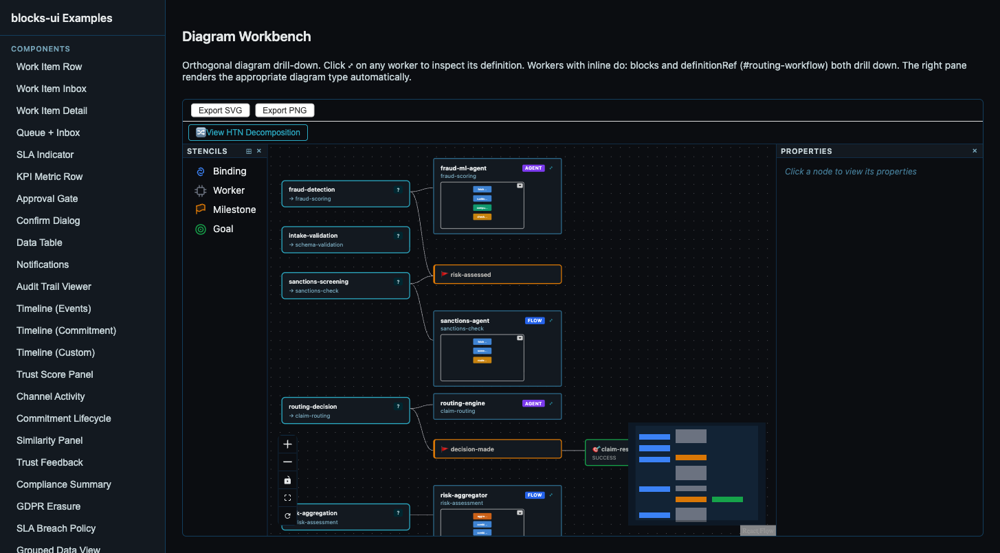
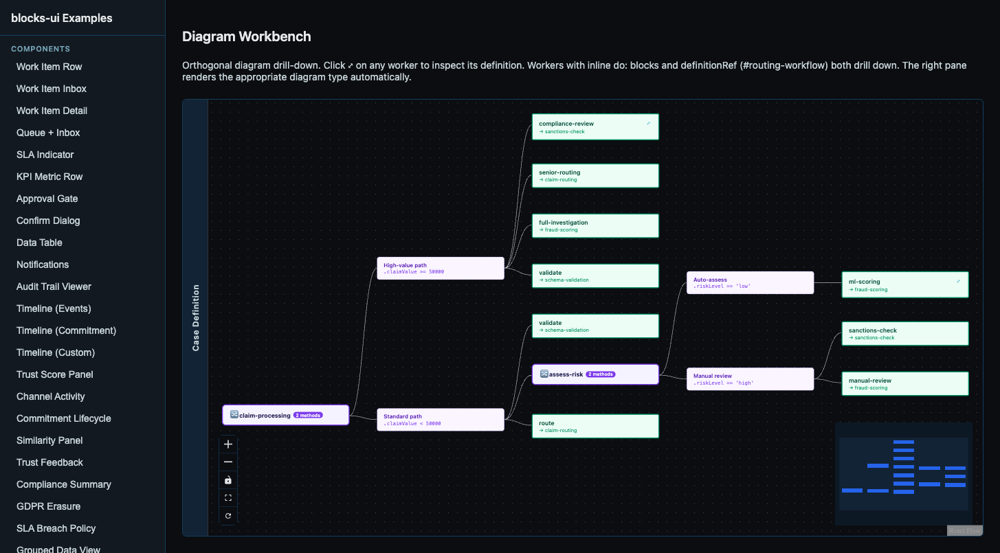
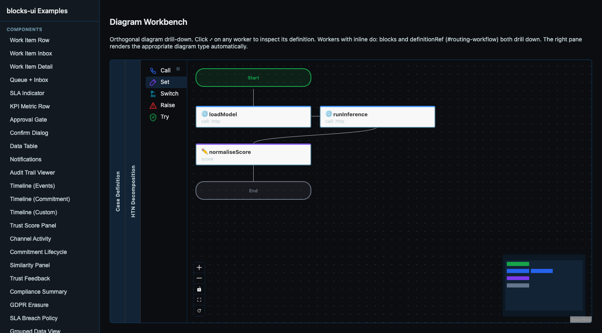

A case definition describes what can happen — bindings, workers, capabilities, milestones. An HTN decomposition describes the strategy for making it happen — which tasks, in what order, under what conditions. A Serverless Workflow describes the mechanics of a single worker's execution — call this API, set that variable, switch on this condition.

These three diagram types are different views of the same system. Until now, each lived in isolation. You could see a case diagram or an SWF workflow, but clicking a worker didn't show you what it actually does. The drill-down from case to SWF was hardcoded — one combination, one direction.

The work in this session made drill-down orthogonal. Any diagram type can reference any other. The composition is at the workbench level, not the component level.

## How it works

The `definitionRef` field on any YAML node points to another definition. Two forms: `#local-name` resolves from a `definitions:` block in the same YAML file, and `path/to/file.yaml` fetches externally. The engine landed this in #951 — workers can reference HTN plans, SWF workflows, sub-cases, or anything else by path or local fragment.

The UI side has three layers. A stencil (the visual node in the graph) emits a lightweight `diagram:drill-down` event with the ref. The diagram component resolves it — looks up `definitions:`, fetches external files, wraps inline `do:` blocks. Then it detects the diagram type from YAML structure (`spec.decomposition` → HTN, `document.dsl` + `do:` → SWF, `spec.bindings` → case) and emits a resolved event. The workbench pushes onto a stack and renders the right component via a type→tag map.

The case diagram shows the full claim-adjudication model — fraud-ml-agent, sanctions-agent, risk-aggregator, routing-engine. The "View HTN Decomposition" button appears because the YAML has `spec.decomposition:`.

## The stack UX

I wanted a UX where drilling down doesn't lose the parent context. Each level collapses to a thin vertical strip with its name rotated. Only the deepest level gets the full canvas. Clicking any strip pops back to that level — everything below it disappears.

The HTN tree decomposes claim-processing into two method branches: "Standard path" (claims under 50k) and "High-value path" (claims over 50k). The standard path further decomposes assess-risk into auto-assess and manual-review branches based on risk level. Each leaf task shows its capability reference. "Case Definition" is the collapsed strip on the left — click it to return.

From here, the ml-scoring leaf has `definitionRef: '#ml-scoring-flow'`, so clicking its ⤢ drills into the SWF workflow:

Three levels deep. Two collapsed strips (Case Definition, HTN Decomposition), the SWF workflow full-width showing loadModel → runInference → normaliseScore. The stack has no depth limit — each definition can reference another, and the strips accumulate.

## The showcase demonstrates all combinations

The example YAML exercises four cross-type drill-downs:

| From | To | What triggers it |
|------|----|-----------------|
| Case → HTN | "View HTN Decomposition" button | `spec.decomposition:` present |
| HTN → SWF | ml-scoring leaf | `definitionRef: '#ml-scoring-flow'` |
| HTN → Case | compliance-review leaf | `definitionRef: '#compliance-case'` |
| SWF → HTN | planAssignment call task | `definitionRef: '#assignment-plan'` |

No direction is special. Case can drill into HTN, HTN can drill into SWF, SWF can drill into HTN — all through the same mechanism. Adding a new diagram type means adding a detection case in `detectDiagramType`, a tag in the workbench's `DIAGRAM_TAGS` map, and importing the component. The protocol doesn't change.

## What else landed

The session covered more ground than just drill-down. We wired pages' graph editing capabilities (editPolicy + onMutation) into the diagram components — #141 through #143. This means pages' built-in editing UX (connect-end-on-empty picker, context menus, edge reconnection) now works in both case and SWF diagrams. The blocks-ui side just maps `GraphEdit` objects to CST-preserving YAML mutations.

We modelled the binding target type (capability/subCase/humanTask) as a proper `x-discriminator` in the binding schema (#144), consistent with functionType and triggerType. One less custom UI path — the EditorResolver handles it generically now.

The #389 migration cleanup removed the last backwards-compat cruft — deprecated commitment-state-pill, diagram-core stub, stale re-exports. We audited every component and package against a simple filter: "would a non-CaseHub pages app use this?" The primitives moved to pages. The business patterns stayed.

## What this opens up

The orthogonal drill-down is infrastructure. The immediate value is navigating complex case definitions — but the same mechanism works for any future diagram type. GOAP state machines, choreography diagrams, DAG execution plans — they plug into the same stack.

The HTN tree view also changes how we think about case authoring. The case diagram shows what's available; the HTN shows the strategy for using it. They're two views of the same YAML, linked by the drill-down. Editing one should update the other — that's the next step.
